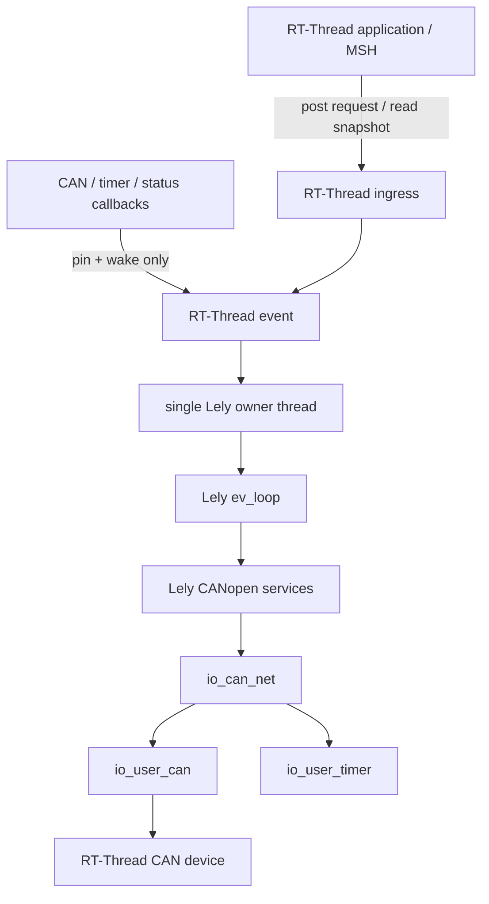

[中文](README.zh-CN.md)

# Lely CANopen RT-Thread

> 摘要：RT-Thread port of Lely CANopen using a single-owner EV/IO2 runtime, static OD generation, and optional Master services.

This repository integrates the pure-C Lely CANopen stack with RT-Thread while preserving Lely's `ev` executor and `io2` asynchronous I/O model. RT-Thread owns threads, device callbacks, time sources, and cross-thread ingress; one dedicated owner thread serializes every Lely EV/IO2/CANopen object access.

The package is designed around static target content. Object Dictionaries are generated on the host and compiled into firmware; the target keeps `LELY_NO_CO_DCF=1` and does not parse DCF files at runtime.

## Main capabilities

- Single-owner Lely runtime built with `LELY_NO_THREADS=1`, `LELY_NO_ATOMICS=1`, and `LELY_NO_TIMEOUT=1`.
- RT-Thread CAN bridge based on `io_user_can`, `io_user_timer`, `io_can_net`, and `ev_loop`.
- Optional automatic runtime creation through `INIT_APP_EXPORT()` or explicit application-owned lifecycle APIs.
- Optional CAN FD mapping with an explicit BSP `rt_can_msg.len` convention.
- Optional hardware CAN acceptance-filter setup and BSP-specific CAN status mapping hooks.
- Static Master Object Dictionary binding generated by `dcfgen` + `dcf2c`.
- Owner-safe Master NMT commands, Client-SDO transactions, manual NMT configuration, local OD access, TPDO events, SYNC/PDO control, EMCY, and TIME bridges.
- Optional RT-Thread MSH root command `co` for the checked-in Master + Node1 example.
- Frozen-upstream metadata, source allowlists, and SHA-256 verification for reproducible target source selection.

## Repository layout

```text
lely-canopen-rtt/
├── Kconfig
├── SConscript
├── port/rtthread/                 # RT-Thread runtime and adaptation layer
├── examples/
│   ├── master_node1/              # Local Master OD and Host generation inputs
│   └── node1/                     # Remote Node1 DCF fixture
├── metadata/                      # Upstream identity and source-selection policy
├── tools/                         # Host generation and vendor-maintenance tools
├── tests/host/                    # Host/source-level regression tests
└── docs/
    ├── en/                        # English manual
    └── zh/                        # 中文手册
```

The full repository also expects the frozen `upstream/` tree described by `metadata/UPSTREAM.lock` and the two allowlists. `SConscript` only compiles target-eligible sources listed in `metadata/RTTHREAD_SOURCE_ALLOWLIST.txt`.

## Requirements

Enabling `PKG_USING_LELY` selects the RT-Thread heap, device, CAN, and event components. Additional dependencies are selected only by the features that need them, for example ULOG, message queues, FINSH/MSH, and CAN FD.

The runtime assumes a usable RT-Thread CAN device and a BSP whose CAN command semantics match the selected configuration. Hardware-specific CAN status fields, acceptance filters, and CAN FD length encoding are intentionally not guessed by the generic port.

## Quick start

For the checked-in automatic Master example:

1. Integrate this package into the target RT-Thread project and expose its `Kconfig`/`SConscript`.
2. Enable `PKG_USING_LELY` and `PKG_LELY_APP_AUTO_INIT`.
3. Configure `PKG_LELY_CAN_DEV_NAME`, bitrate, owner-thread resources, and BSP-specific CAN options.
4. Enable `PKG_LELY_EXAMPLE_MASTER_NODE1` if the bundled local Master OD is wanted.
5. Enable only the Master control-plane features required by the application.
6. Build with the real BSP/toolchain, flash the board, and validate CAN behavior on the target network.

See [Quick start](docs/en/quick-start.md) and [Configuration](docs/en/configuration.md).

## Runtime architecture



Callbacks outside the owner context never call Lely directly. They wake the owner and use a runtime lifetime pin so shutdown can drain in-flight callbacks before Lely objects are destroyed.

See [RT-Thread integration](docs/en/rt-thread-integration.md).

## Static Object Dictionary and Master example

`examples/master_node1/master_sdev.c` is the MCU's local Master Object Dictionary. `examples/node1/node1.dcf` describes a remote slave and is only a Host-side input to Master generation. The target never instantiates that remote DCF as its local device.

The primary Host flow is:

```text
remote DCF + master YAML
        -> dcfgen
        -> compact Master DCF
        -> dcf2c --no-strings
        -> static master_sdev.c
```

See [Object Dictionary](docs/en/object-dictionary.md), [Host generation](docs/en/host-generation.md), and the [Master + Node1 example](examples/master_node1/README.md).

## Master control plane

The public owner-safe API is declared in `port/rtthread/include/lely/rtthread/runtime.h`. Depending on Kconfig, it exposes:

- local and remote NMT snapshots plus boot-result snapshots;
- asynchronous NMT commands;
- request-object based SDO upload/download and block transfer;
- explicit manual NMT configuration using concise DCF data;
- local manufacturer OD access in `0x2000..0x5FFF`;
- static TPDO event triggering and local PDO transmission-type control;
- SYNC period control and post-PDO SYNC snapshots/callbacks;
- bounded remote EMCY history and local EMCY producer controls;
- received TIME snapshots and explicit absolute TIME transmission.

See [Master control plane](docs/en/master-control-plane.md).

## Documentation

Start with the [documentation index](docs/en/index.md). The documentation is maintained as paired English and Chinese topic pages rather than development-stage notes.

## Validation boundary

This documentation refactor is grounded in the uploaded source, Kconfig, public headers, examples, and host tests. It does not turn source review into target evidence. A real BSP build, board execution, CAN timing, bus-off behavior, CAN FD behavior, and multi-node HIL remain target-specific validation work.

## License

Preserve the repository `LICENSE` and `NOTICE` files and all applicable upstream notices when redistributing the package.
