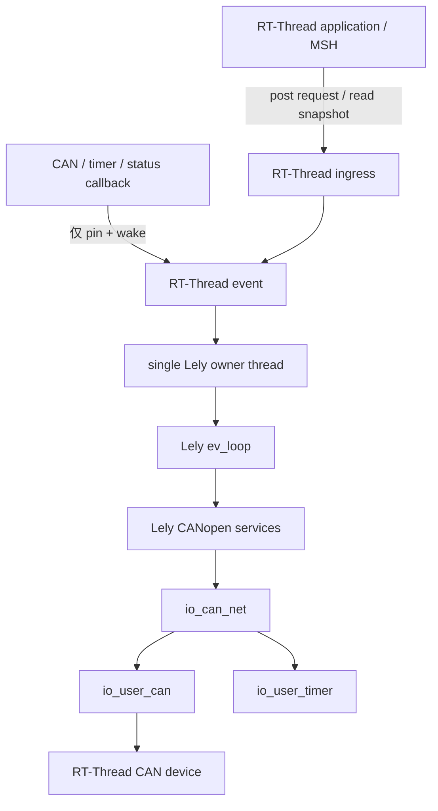

[English](README.md)

# Lely CANopen RT-Thread

> 摘要：将冻结的 Lely CANopen 子集移植到 RT-Thread，采用 single-owner EV/IO2 runtime、Host 静态对象字典生成和可选 Master 控制面。

本仓库把 Lely CANopen 的纯 C 协议栈集成到 RT-Thread，并保留 Lely 的 `ev` 执行器与 `io2` 异步 I/O 模型。RT-Thread 负责线程、设备回调、时间源和跨线程入口；Lely EV/IO2/CANopen 对象始终由一个专用 owner thread 串行访问。

目标端采用静态内容：对象字典在 Host 上生成后编译进固件，target 保持 `LELY_NO_CO_DCF=1`，不会在 MCU 运行时解析 DCF。

## 主要能力

- 以 `LELY_NO_THREADS=1`、`LELY_NO_ATOMICS=1`、`LELY_NO_TIMEOUT=1` 构建 single-owner Lely runtime。
- 使用 `io_user_can`、`io_user_timer`、`io_can_net` 和 `ev_loop` 接入 RT-Thread CAN 与时间源。
- 支持 `INIT_APP_EXPORT()` 自动创建默认 runtime，也支持应用显式管理 create/start/stop/destroy 生命周期。
- 可选 CAN FD，并显式配置 BSP 的 `rt_can_msg.len` 是 payload byte count 还是 raw DLC。
- 可选硬件 CAN acceptance filter hook 与 BSP 专用 CAN status mapper。
- 使用 `dcfgen` + `dcf2c` 生成并绑定静态 Master Object Dictionary。
- 可选 owner-safe Master NMT、Client-SDO、手动 NMT 配置、本地 OD、TPDO、SYNC/PDO、EMCY、TIME 控制面。
- 可选 RT-Thread MSH 根命令 `co`，用于仓库内 Master + Node1 示例。
- 通过 frozen-upstream 元数据、源码 allowlist 和 SHA-256 manifest 控制目标编译边界。

## 仓库结构

```text
lely-canopen-rtt/
├── Kconfig
├── SConscript
├── port/rtthread/                 # RT-Thread runtime 与适配层
├── examples/
│   ├── master_node1/              # 本地 Master OD 与 Host 生成输入
│   └── node1/                     # 远端 Node1 DCF fixture
├── metadata/                      # upstream 身份和源码选择策略
├── tools/                         # Host 生成与 vendor 维护工具
├── .github/ci/lely-canopen-rtt/   # Host/源码级 CI 回归测试
└── docs/
    ├── en/                        # English manual
    └── zh/                        # 中文手册
```

完整仓库还需要 `metadata/UPSTREAM.lock` 与 allowlist 所描述的 frozen `upstream/` tree。`SConscript` 只从 `metadata/RTTHREAD_SOURCE_ALLOWLIST.txt` 中选择允许进入 target build 的源文件。

## 依赖

启用 `PKG_USING_LELY` 后，Kconfig 会选择 RT-Thread heap、device、CAN 和 event。ULOG、message queue、FINSH/MSH、CAN FD 等依赖只在相应功能开启时引入。

Runtime 要求存在可用的 RT-Thread CAN 设备，并且 BSP 的 CAN command 语义与配置一致。硬件状态字段、acceptance filter 和 CAN FD 长度编码属于 BSP 契约，通用适配层不会自行猜测。

## 快速接入

使用仓库内自动 Master 示例时：

1. 将本包接入目标 RT-Thread 工程，并使 `Kconfig`/`SConscript` 进入工程构建。
2. 启用 `PKG_USING_LELY` 与 `PKG_LELY_APP_AUTO_INIT`。
3. 配置 `PKG_LELY_CAN_DEV_NAME`、bitrate、owner thread 资源和 BSP 专用 CAN 选项。
4. 如需仓库内静态 Master OD，启用 `PKG_LELY_EXAMPLE_MASTER_NODE1`。
5. 仅启用应用确实需要的 Master control-plane feature。
6. 使用真实 BSP/toolchain 构建并烧录，再在实际 CAN 网络上验证运行行为。

详见[快速接入](docs/zh/quick-start.md)和[配置指南](docs/zh/configuration.md)。

## Runtime 架构



owner 以外的 callback 不直接调用 Lely，只负责唤醒 owner，并通过短生命周期 pin 保护 runtime；shutdown 会先关闭 callback admission，再等待已进入的 callback 退出，最后销毁 Lely 对象。

详见[RT-Thread 集成](docs/zh/rt-thread-integration.md)。

## 静态对象字典与 Master 示例

`examples/master_node1/master_sdev.c` 是 MCU 本地 Master Object Dictionary；`examples/node1/node1.dcf` 描述的是远端 slave，只作为 Host 端生成 Master OD 的输入。target 不会把该远端 DCF 实例化成本地设备。

主要 Host 生成链：

```text
remote DCF + master YAML
        -> dcfgen
        -> compact Master DCF
        -> dcf2c --no-strings
        -> static master_sdev.c
```

详见[对象字典](docs/zh/object-dictionary.md)、[Host 生成工具链](docs/zh/host-generation.md)和[Master + Node1 示例](examples/master_node1/README.zh-CN.md)。

## Master 控制面

公开 owner-safe API 位于 `port/rtthread/include/lely/rtthread/runtime.h`。根据 Kconfig 可提供：

- 本地/远端 NMT 状态 snapshot 与远端 boot 结果 snapshot；
- 异步 NMT command；
- request-object 形式的普通与 block SDO upload/download；
- 使用 concise DCF 的显式手动 NMT configuration；
- `0x2000..0x5FFF` 本地 manufacturer OD 访问；
- 静态 TPDO event 与本地 PDO transmission type 控制；
- SYNC period 与 post-PDO SYNC snapshot/callback；
- 有界 remote EMCY history 和本地 EMCY producer 操作；
- 收到的 TIME snapshot 与显式绝对时间发送。

详见[Master 控制面](docs/zh/master-control-plane.md)。

## 文档

从[中文文档索引](docs/zh/index.md)开始。文档现在按集成任务和运行机制组织，中英文页面一一对应；历史开发阶段编号不再作为主要阅读入口。

## 验证边界

本次文档重构依据上传源码、Kconfig、公开头文件、示例与 Host 测试组织事实，但这不等于 target 验证。真实 BSP build、目标板运行、CAN 时序、bus-off、CAN FD 与多节点 HIL 仍需在具体硬件环境执行。

## License

重新分发时应保留仓库 `LICENSE`、`NOTICE` 以及适用的 upstream 版权和许可证信息。
