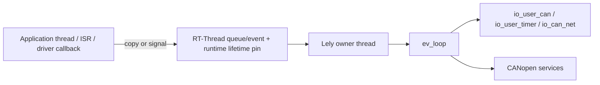

# RT-Thread Integration and Single-Owner Runtime

> 摘要：How the single owner serializes Lely objects while RT-Thread callbacks, CAN, timers, and teardown cross the boundary.

[中文](../zh/rt-thread-integration.md)

The central design rule is simple: RT-Thread may be multithreaded, but Lely is compiled as a single-threaded library and every Lely EV/IO2/CANopen object is owned by one dedicated thread.

## 1. Ownership boundary

`port/rtthread/lely_rtt_config.h` fixes the target policy:

```c
#define LELY_NO_THREADS 1
#define LELY_NO_ATOMICS 1
#define LELY_NO_TIMEOUT 1
```

These macros describe Lely's internal build, not the whole RT-Thread system. RT-Thread threads, ISRs, and driver callbacks still exist. They simply must not enter Lely objects directly.



The owner boundary is what makes `LELY_NO_THREADS=1` valid in a multithreaded RTOS: Lely does not provide internal synchronization because the port provides external serialization.

## 2. Callback path

The RT CAN RX callback, optional CAN status callback, and RT one-shot timer callback do not process CANopen directly. Their responsibilities are deliberately bounded:

1. acquire a short runtime lifetime pin;
2. set the corresponding RT-Thread event bit;
3. release the pin.

The owner thread then drains RX, updates timer state, samples/injects CAN status changes, dispatches Master commands, and drains `ev_loop` work.

The shared event is also used for bounded lifecycle acknowledgements. Work bits wake the owner; READY/EXIT bits wake the external lifecycle caller.

## 3. CAN RX and TX semantics

RX indication only signals work. On each owner wakeup the runtime reads at most `rx_batch` frames from the RT-Thread CAN software FIFO before allowing other event classes to run. After `io_can_net` starts, the runtime also performs an explicit RX FIFO probe because installing an RX callback does not replay notifications for frames buffered earlier during startup.

TX is intentionally non-blocking. The selected RT-Thread CAN path must provide the non-blocking send behavior required by the port. A full non-blocking TX ring maps to a no-buffer condition instead of a retry loop that could busy-spin the single owner.

An RT-Thread write accepted by the driver is treated as completion by `io_user_can`; this is not a hardware TX-complete acknowledgement.

## 4. CAN FD contract

Lely represents `can_msg.len` as payload bytes. RT-Thread BSPs may interpret `rt_can_msg.len` either as payload bytes or as raw DLC for CAN FD. The runtime configuration makes that BSP contract explicit through `can_fd_len_mode`.

DLC mode maps 0..15 to the standard CAN FD payload lengths and zero-pads rounded TX frames. Byte mode passes the payload length directly. CAN FD frames are rejected when package or runtime capability is disabled.

The generic RT-Thread CAN message used by this port does not expose all Lely CAN FD flags. For example, an outbound Lely frame requiring ESI is rejected rather than silently discarding the information.

## 5. Time model

The transport runtime extends `rt_tick_get()` into monotonic uptime and converts it to `struct timespec`. This clock drives protocol deadlines through `io_user_timer`; it is not UTC and must not be reused as CANopen TIME wall-clock data.

`io_user_timer` publishes its next absolute deadline. The port arms an RT-Thread one-shot timer and rounds deadlines upward to avoid early expiry. Long deadlines are reached through intermediate wakeups when necessary for the RT-Thread timer range.

If the one-shot timer cannot be armed, the runtime fails closed and requests owner shutdown instead of repeatedly self-waking.

## 6. Hardware acceptance filters and CAN status

`filter_setup` is an optional startup-only hook. Hardware filtering is a performance optimization; Lely's software receive tree remains the correctness filter. A restrictive hardware filter must cover every CANopen COB-ID that can be valid under the product's runtime configuration.

`status_mapper` is an optional owner-thread translator for BSP-specific `rt_can_status` semantics. Without it, the port uses a conservative mapping based on REC/TEC thresholds and changes in common error counters. If the BSP encodes controller state differently, the product should supply an explicit mapper rather than depending on guessed meanings.

## 7. Startup and shutdown

`lely_rtt_runtime_start()` creates the owner thread and waits for a bounded READY acknowledgement. `lely_rtt_runtime_stop()` asks the owner to tear down and waits for a bounded EXIT acknowledgement.

A timeout is not a destruction barrier. Runtime storage remains valid and must not be freed until a later `stop()` call observes owner exit.

The safety-critical teardown order is:

```text
close callback admission
    -> detach RX/status producers and stop controller
    -> remove runtime from callback registry
    -> stop RT one-shot timer
    -> drain callback lifetime refs
    -> io_ctx_shutdown()
    -> drain EV cancellation/completion work
    -> destroy CANopen / io_can_net / io_user_* objects
    -> destroy ev_loop / io_ctx
    -> publish EXIT
```

The callback refcount is required because unregistering a callback does not prove that a callback which entered just before unregistration has already returned.

## 8. Master services stay inside the same owner

The optional Master control plane does not add a second Lely thread. Application/MSH threads post copied commands or read owner-published snapshots. SDO request objects, manual configuration, local OD access, PDO/SYNC, EMCY, and TIME all preserve the same ownership boundary.

See [Master control plane](master-control-plane.md) for the API-level contracts.

## 9. Validation boundary

Static review can verify the intended ownership relationships, event paths, source-selection policy, and API contracts. It cannot prove BSP-specific CAN command support, interrupt timing, queue pressure, bus-off recovery, or CAN FD semantics. Those remain target tests.
