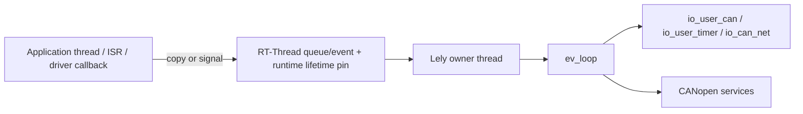

# RT-Thread 集成与 Single-Owner Runtime

> 摘要：解释为什么所有 Lely EV/IO2/CANopen 对象只由一个 owner thread 访问，以及 RT-Thread callback、时间、CAN I/O 和 teardown 如何安全跨越该边界。

[English](../en/rt-thread-integration.md)

整个移植的核心规则只有一个：RT-Thread 本身可以是多线程系统，但 Lely 以 single-thread 方式编译，所有 Lely EV/IO2/CANopen 对象都归一个专用 owner thread 所有。

## 1. Ownership 边界

`port/rtthread/lely_rtt_config.h` 固定 target policy：

```c
#define LELY_NO_THREADS 1
#define LELY_NO_ATOMICS 1
#define LELY_NO_TIMEOUT 1
```

这些宏描述的是 Lely 内部构建方式，不表示整个 RT-Thread 只能有一个线程。应用线程、ISR 和 driver callback 仍然存在，但它们不能直接进入 Lely 对象。



正是这条 owner 边界让 `LELY_NO_THREADS=1` 可以用于多线程 RTOS：Lely 不承担内部同步，由 port 在外部保证串行化。

## 2. Callback 路径

RT CAN RX callback、可选 CAN status callback 和 RT one-shot timer callback 都不直接执行 CANopen。它们只做三件事：

1. 获取一个短生命周期 runtime pin；
2. 设置对应的 RT-Thread event bit；
3. 释放 pin。

随后由 owner thread drain RX、推进 timer、采样/注入 CAN status 变化、dispatch Master command，并处理 `ev_loop` 工作。

同一个 event 还承担有界 lifecycle acknowledgement：work bit 唤醒 owner，READY/EXIT bit 唤醒外部 `start()`/`stop()` caller。

## 3. CAN RX/TX 语义

RX indication 只表示“有工作”。owner 每次被唤醒后最多从 RT-Thread CAN software FIFO 读取 `rx_batch` 帧，然后让其它 event class 获得执行机会。`io_can_net` 启动后还会主动 probe 一次 RX FIFO，因为安装 RX callback 不会自动补发 startup 期间已经缓冲的 frame notification。

TX 明确采用 non-blocking 语义。所选 RT-Thread CAN driver path 必须提供本 port 需要的 non-blocking send；TX ring 满时映射为 no-buffer，而不是让 single owner 因重复 repost 同一写请求而 busy-spin。

RT-Thread driver 接受一帧写入后，`io_user_can` 就认为该次 write 完成；这不是硬件 TX-complete acknowledgement。

## 4. CAN FD 契约

Lely 的 `can_msg.len` 始终表示 payload bytes，但 RT-Thread BSP 对 CAN FD 的 `rt_can_msg.len` 可能表示 byte count，也可能表示 raw DLC。Runtime 通过 `can_fd_len_mode` 显式声明这个 BSP 契约。

DLC 模式按标准 CAN FD 长度把 0..15 映射到 payload bytes，并对向上取整后的 TX payload 做 zero padding；byte 模式直接传字节数。package 或 runtime 未启用 CAN FD 时，CAN FD frame 会被拒绝。

当前通用 RT-Thread CAN message 并不暴露全部 Lely CAN FD flag。例如发送端要求 ESI 时，port 会拒绝该 frame，而不是静默丢弃该语义。

## 5. 时间模型

transport runtime 把 `rt_tick_get()` 扩展成 monotonic uptime，再转换为 `struct timespec`，用于 `io_user_timer` 的协议 deadline。它不是 UTC，也不能直接作为 CANopen TIME 的 wall-clock source。

`io_user_timer` 发布下一次 absolute deadline；port 使用 RT-Thread one-shot timer，向上舍入 deadline 防止提前触发。超过 RT-Thread timer 半范围限制的长 deadline 会通过中间 wakeup 逐步抵达。

如果 one-shot timer 无法 arm，runtime 会 fail closed 并请求 owner shutdown，而不是反复自唤醒。

## 6. Hardware acceptance filter 与 CAN status

`filter_setup` 是可选 startup-only hook。硬件 filter 只是性能优化，Lely software receive tree 才是 correctness filter。只要产品允许某个 COB-ID 在运行时有效，restrictive hardware filter 就必须覆盖它。

`status_mapper` 用于在 owner thread 中解释 BSP 专用的 `rt_can_status`。没有 mapper 时，port 采用保守映射：主要依据 REC/TEC 阈值以及常见 error counter 的变化。如果 BSP 的状态字段具有控制器专用语义，应提供明确 mapper，而不是让通用层猜测 `errcode`。

## 7. Startup 与 shutdown

`lely_rtt_runtime_start()` 创建 owner thread 并等待有界 READY acknowledgement；`lely_rtt_runtime_stop()` 请求 owner teardown 并等待有界 EXIT acknowledgement。

timeout 不是“现在可以 free”的证明。只要 owner 尚未确认退出，runtime storage 必须保留，并继续调用 `stop()` 直到观察到退出后再 `destroy()`。

关键 teardown 顺序为：

```text
close callback admission
    -> detach RX/status producer 并 stop controller
    -> 从 callback registry 移除 runtime
    -> stop RT one-shot timer
    -> drain callback lifetime refs
    -> io_ctx_shutdown()
    -> drain EV cancellation/completion work
    -> destroy CANopen / io_can_net / io_user_* objects
    -> destroy ev_loop / io_ctx
    -> publish EXIT
```

callback refcount 是必要边界：取消注册 callback 并不能证明“刚好在取消前已经进入的 callback”已经返回。

## 8. Master 服务仍在同一个 owner 内

可选 Master control plane 不会再增加一个 Lely thread。Application/MSH thread 只发送复制后的 command，或读取 owner 发布的 snapshot。SDO request、manual configuration、本地 OD、PDO/SYNC、EMCY、TIME 都继续服从同一 ownership 边界。

API 级语义见[Master 控制面](master-control-plane.md)。

## 9. 验证边界

静态审查可以确认 ownership、event path、source-selection policy 和 API contract 是否前后一致，但不能证明具体 BSP 的 CAN command 支持、中断时序、queue pressure、bus-off recovery 或 CAN FD 语义。它们仍需要 target 验证。
